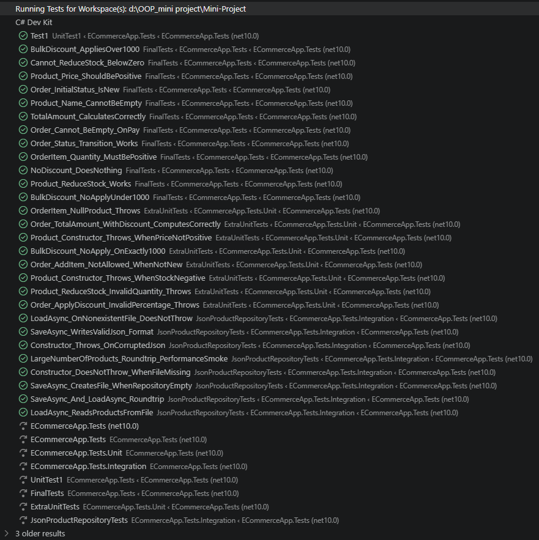

# TEST SUMMARY

Короткий огляд тестів у `tests/ECommerceApp.Tests`

## Загалом
- Типи тестів: юніт та інтеграційні тести.
- Основні файли з тестами:
  - `FinalTests.cs` — юніт-тести для доменних сутностей та патернів (Product, Order, OrderItem, Discount Strategies).
  - `UnitTest1.cs` — порожній шаблонний тест (заглушка).
  - `Integration/JsonProductRepositoryTests.cs` — інтеграційні тести для `JsonProductRepository` (завантаження/збереження, roundtrip, формат JSON, коректність роботи з файлами).

## Короткий опис ключових тестів (приклади)
- Перевірки `Product`:
  - Ціна більша за нуль.
  - Зменшення запасу (`ReduceStock`) коректне та кидає виняток при переповненні.
  - Ім'я продукту не може бути порожнім.

- Перевірки `Order` та `OrderItem`:
  - Початковий статус `Order` — `New`.
  - `TotalAmount` обчислюється коректно.
  - Неможливо оплатити порожнє замовлення (викидається `InvalidOperationException`).
  - Переходи статусів (`MarkAsPaid`) працюють при наявності позицій.

- Перевірки стратегій знижок:
  - `NoDiscountStrategy` не змінює суму.
  - `BulkDiscountStrategy` застосовує знижку для сум понад поріг.

- Інтеграційні тести для `JsonProductRepository`:
  - Збереження створює файл та записує валідний JSON.
  - Завантаження читає продукти з файлу.
  - Конструктор поводиться коректно при відсутності файлу і при пошкодженому JSON.
  - Roundtrip save/load зберігає і повертає список продуктів.

## Як запускати тести локально
```powershell
dotnet test tests/ECommerceApp.Tests/ECommerceApp.Tests.csproj
```

## Результати (локальний прогін)
- Останній локальний прогін: 29 пройдено, 0 провалено.

## Де шукати докладніше
- Перегляньте тести: `tests/ECommerceApp.Tests/FinalTests.cs` та `tests/ECommerceApp.Tests/Integration/JsonProductRepositoryTests.cs` для повних прикладів асерцій.
- Додаткові нотатки про тестування знаходяться в `tests/ECommerceApp.Tests/testdocs.md`.

